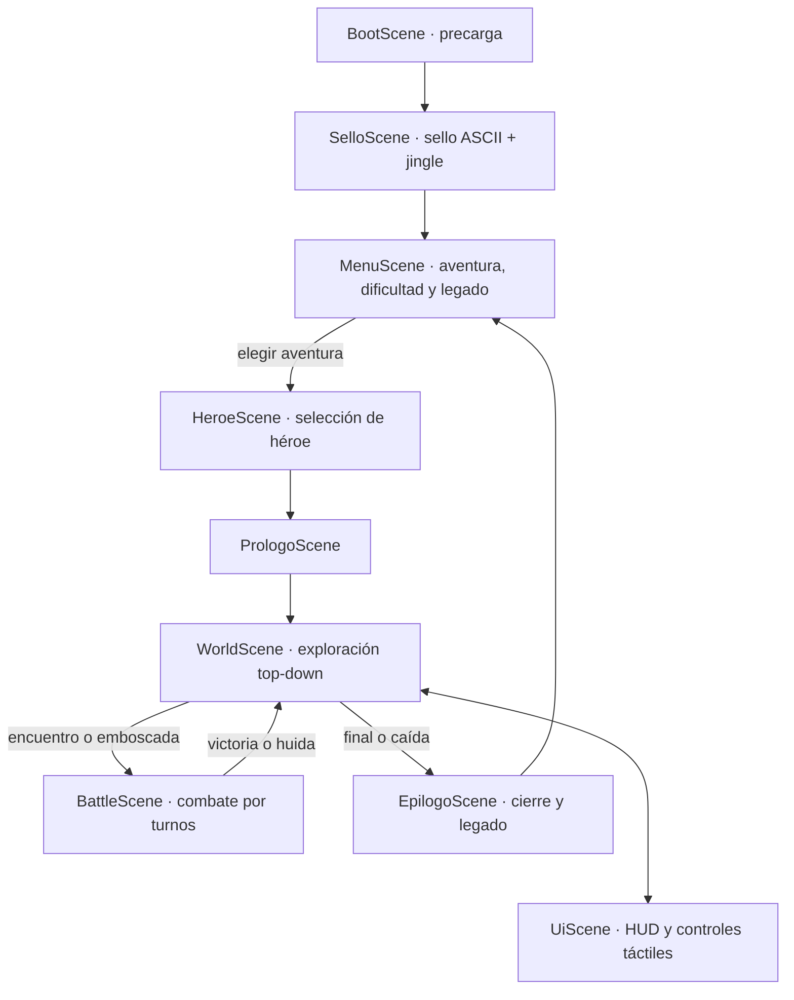

# Aldamar 2

[](https://github.com/juliangt/aldamar2/actions/workflows/ci.yml)
[](https://github.com/juliangt/aldamar2)
[](https://developer.mozilla.org/es/docs/Web/JavaScript)
[](https://phaser.io)
[](https://nodejs.org)
[](#cómo-jugar)

**Aldamar 2** es un RPG táctil 8-bit por turnos para navegador móvil y escritorio. Es la secuela directa de **[Aldamar](https://github.com/juliangt/aldamar)**, la aventura de fantasía épica original para terminal escrita en Python: el mismo mundo y el mismo lore, ahora con exploración top-down en 39 mapas Tiled, diálogos interactivos, economía y tiendas, compañeros reclutables, combate táctico por turnos con jefes por fases, sistema de corrupción de la Grieta (0–100), audio sintetizado en tiempo real y un meta-sistema de **legado persistente** entre sus cuatro aventuras.

- **Motor:** [Phaser 4](https://phaser.io) + [Vite](https://vitejs.dev)
- **Audio:** sintetizador WebAudio procedural 8-bit (cero archivos externos)
- **Arte:** Kenney Tiny Dungeon ([CC0 1.0 Universal](https://creativecommons.org/publicdomain/zero/1.0/))
- **Idioma:** español
- **Enfoque:** móvil-first (táctil con botones ≥ 48 px) y pantalla completa en escritorio

---

## Índice

1. [Origen: de la terminal al navegador](#origen-de-la-terminal-al-navegador)
2. [La historia](#la-historia)
3. [Las cuatro aventuras](#las-cuatro-aventuras)
4. [Características principales](#características-principales)
5. [Cómo jugar](#cómo-jugar)
6. [Arquitectura](#arquitectura)
7. [Calidad y pruebas](#calidad-y-pruebas)
8. [Pipeline de CI](#pipeline-de-ci)
9. [Desarrollo e instalación](#desarrollo-e-instalación)
10. [Documentación](#documentación)
11. [Créditos y licencias](#créditos-y-licencias)

---

## Origen: de la terminal al navegador

Todo empezó con **[Aldamar](https://github.com/juliangt/aldamar)** — «Juego. Aventura de fantasía épica original para la terminal, en español» —, un juego de texto en Python cuyo motor de turnos, bestiario y diálogos alimentaron la [spec maestra](specs/spec_desarrollo.md) de esta secuela. Aldamar 2 conserva aquella columna vertebral narrativa y la convierte en un RPG visual y táctil: la máquina de estados de combate que vivía en la terminal ahora es `src/core/Combate.js`, y los diálogos que se desplegaban por línea de comandos hoy corren sobre mapas, sprites y audio sintetizado.

---

## La historia

Hace mil lunas, el hechicero **Morvath** forjó el **Corazón de Ceniza** en el Monte Umbak. Esta noche el amuleto despertó en un baúl de Vegaverde… y llamó a los cuervos.

La historia completa del mundo —las razas libres, el camino a la Forja Eterna, los héroes, los compañeros y el reparto de cada aventura— vive en **[docs/historia.md](docs/historia.md)**.

> **Aviso de spoilers:** ese documento cuenta los comienzos de las cuatro aventuras y quiénes las habitan. Los desenlaces, las decisiones y sus precios quedan para quien juega.

---

## Las cuatro aventuras

Cuatro aventuras independientes pero encadenadas por el **legado**: las decisiones, finales y juramentos de los héroes trascienden entre partidas (se heredan banderas y fama; nunca inventario, niveles ni monedas).

| # | Aventura | Tipo | Lugares | Héroes | Jefe final |
|---|----------|------|:-------:|:------:|------------|
| 1 | **El Corazón de Ceniza** | Campaña | 12 | 4 (Tilo, Ithel, Dagna, Ruy) | el Custodio Pálido |
| 2 | **La Brasa de Vegaverde** · Ascuas I | Misión | 5 | 1 (Enebro) | el Espantapájaros Ahumado |
| 3 | **La Sal y la Ceniza** · Ascuas II | Campaña | 9 | 3 (Bruna, Gala, Támara) | la Viuda de Sal |
| 4 | **La Aguja sin Sombra** · Ascuas III | Saga | 13 | 3 (Renco, Vela, Bram) | Morvath, tejido de humo |

**En total:** 39 lugares (un mapa Tiled por lugar), 11 héroes con dones propios, 9 compañeros reclutables, 23 definiciones de enemigo, 3 dificultades y 4 secretos por descubrir.

---

## Características principales

- **Identidad sonora 8-bit sintetizada:** jingle del sello al inicio y en cada cierre de aventura, set completo de 10 SFX (diálogo, monedas, golpes, daño, curación, nivel, victoria, derrota, secretos) y pads armónicos atmosféricos por bioma, todo generado por osciladores WebAudio sin un solo asset de audio.
- **La Grieta y el Comando Especial:** cada aventura dispone de un comando único (`corazon`, `marea`, `eco`) que inflige daño devastador a cambio de abrir la grieta. Alcanzar 100 puntos precipita la caída irreversible del héroe.
- **Dificultades calibradas:**
  - *Paseo por el huerto* — más vida y monedas, enemigos dóciles, pensada para sumergirse en la historia.
  - *El camino* — el equilibrio clásico con el que fue concebida la aventura.
  - *Yermos de Ceniza* — enemigos brutales, corrupción despiadada y penalización de curación para veteranos.
- **Vista adaptativa:** vertical (270×480) u horizontal (480×270) detectada de forma nativa; al girar el dispositivo todas las escenas se re-encuadran en caliente —el combate re-organiza héroes, enemigos y botones; los diálogos re-paginan su texto pendiente— sin recargar ni perder la partida.
- **Ciclo de vida móvil y accesibilidad:** pausa automática al pasar a segundo plano (`visibilitychange`) que elimina el audio fantasma, botones táctiles con áreas de interacción ≥ 48 px e interfaz optimizada a 60 fps.

---

## Cómo jugar

### Orientación y pantalla

- **Móvil en vertical (agarre natural):** la vista lógica es 270×480; todo el juego (menús, mundo, combate, paneles) se re-organiza para el formato vertical.
- **Móvil en horizontal:** al girar el dispositivo la vista pasa a 480×270 en caliente, sin recargar ni perder la partida (un combate en curso se re-encuadra y continúa).
- **Ordenador:** pantalla completa automática al primer clic (tecla `F` o el botón del menú de pausa para alternarla en cualquier momento).

### En móvil / táctil

- **D-Pad (abajo-izquierda):** mueve al héroe en 8 direcciones.
- **Botón A (abajo-derecha):** acción contextual inteligente según la proximidad (Hablar, Coger, Entrar, Atacar).
- **Botón ≡ (arriba-derecha):** abre el panel de Inventario y Equipo.
- **Botón ⏸ (arriba-derecha):** menú de Pausa y Opciones de Audio (Silenciar, control de volumen, pantalla completa, salir guardando).
- **Toque en pantalla:** avanza diálogos rápidamente y selecciona opciones de menú.

### En ordenador / teclado

| Acción | Controles |
|--------|-----------|
| Moverse | `W` `A` `S` `D` o flechas de dirección |
| Acción / Confirmar | `E`, `Espacio` o `Enter` |
| Pausa / Cancelar | `Escape (ESC)` |
| Pantalla completa | `F` |

---

## Arquitectura

### Principios de diseño

1. **Data-driven:** los JSON de `docs/aventuras/` son la única fuente de verdad del contenido. El motor es genérico: no hay contenido de aventura hard-codeado; añadir texto, balance o enemigos es editar JSON, no código.
2. **Ámbito por aventura:** las claves de enemigos, ítems, tiendas y diálogos se resuelven siempre dentro de la aventura activa (`espectro` tiene stats distintos en la campaña I y en la saga III).
3. **Núcleo puro, presentation aparte:** los motores de combate, eventos, balance y persistencia (`src/core/`) son lógica pura sin dependencias de Phaser, inyectándoles la interfaz como dependencia — así se prueban en Node con Vitest sin levantar el navegador.
4. **Móvil-first desde la resolución:** todas las escenas posicionan contra la vista lógica dinámica (`VISTA`), y un supersampling ×RES mantiene el pixel-art y los textos nítidos en pantalla completa.

### Flujo de escenas



> `ArenaScene` (laboratorio de combate rápido) solo se registra en desarrollo (`import.meta.env.DEV`).

### Estructura del proyecto

```
├── docs/                      # Fuente única de verdad del contenido
│   ├── aventuras/             #   4 aventuras en JSON: lugares, NPCs, enemigos, eventos…
│   ├── rasgos.json            #   dones de los héroes (Ojo de halcón, Piel de piedra…)
│   ├── dificultades.json      #   multiplicadores de balance por dificultad
│   ├── historia.md            #   el lore de Aldamar
│   └── playtesting.md         #   protocolo y reportes de balance
├── public/
│   ├── maps/                  # 39 mapas Tiled (uno por lugar, organizados por aventura)
│   └── tilesets/              # Kenney Tiny Dungeon (CC0)
├── specs/                     # Spec maestra de desarrollo y fases 0–H
├── src/
│   ├── main.js                # arranque, orientación, pausa y pantalla completa
│   ├── config.js              # configuración de Phaser y registro de escenas
│   ├── core/                  # núcleo puro, testeable sin Phaser
│   ├── scenes/                # escenas Phaser
│   ├── ui/                    # componentes de interfaz reutilizables
│   └── assets/                # tipografía Press Start 2P
├── tests/                     # Vitest: unit/, integration/ y suites por sistema
├── e2e/                       # Playwright: flujo end-to-end en navegador real
└── tools/                     # validador de datos y generadores de mapas/tileset
```

### El núcleo (`src/core/`)

| Módulo | Responsabilidad |
|--------|-----------------|
| `Datos.js` | Acceso al contenido de `docs/aventuras/`, siempre en el ámbito de la aventura activa |
| `GameState.js` | Estado vivo y serializable de la partida (vida, nivel, inventario, monedas, grieta) |
| `Combate.js` | Motor de turnos puro: recibe un `GameState` y emite eventos que `BattleScene` traduce en animaciones |
| `EventEngine.js` | Motor narrativo: eventos de entrada al lugar (`narrar`, `emboscar`, `corrupcion`, `curar_grupo`, `otorgar`) y gatillos con condiciones, `una_vez` y `grieta_desde` |
| `Legacy.js` | Legado persistente entre aventuras: juramento, grieta, héroes y finales alcanzados |
| `Audio8.js` | Audio 8-bit sintetizado con WebAudio: jingle, set de SFX, pads ambientales por bioma, volumen y mute persistentes |
| `Sprites.js` | Texturas dinámicas para los 11 héroes, NPCs y enemigos, y paletas de combate por bioma |
| `Balance.js` | Multiplicadores por dificultad con redondeo entero (mín. 1) |
| `Rng.js` | Generador aleatorio determinista por semilla (reproducibilidad de partidas y tests) |
| `Texto.js` | Plantillas de texto con parámetros por héroe/trato |
| `ValidadorMapa.js` | Verifica la coherencia bidireccional entre el JSON de lugar y las capas de objetos del mapa Tiled |
| `resolucion.js` | Vista lógica adaptativa 270×480 / 480×270, supersampling ×RES y evento de re-layout en girar/redimensionar |
| `pantalla.js` | Pantalla completa: entrada al primer gesto (política de navegadores) y alternado con `F` |
| `partida.js` | Singleton del estado de la partida en curso |

### Interfaz (`src/ui/`)

`DialogBox` (diálogos con paginación y re-paginación al girar), `MenuTactil` (D-pad y botones ≥ 48 px), `PanelUI` (paneles y HUD), `InventarioUI`, `TiendaUI` y `SelectorOpciones` (decisiones narrativas).

### Persistencia (`localStorage`)

| Clave | Contenido |
|-------|-----------|
| `aldamar:save:<aventura>` | Partida guardada de cada aventura |
| `aldamar:legado` | Banderas canónicas entre aventuras: juramento, grieta, héroes y finales |
| `aldamar:audio:volumen` / `aldamar:audio:mute` | Preferencias de audio |

---

## Calidad y pruebas

- **283 tests en 32 archivos** (Vitest), todos en verde, organizados en tres niveles:
  - **Unitarios** (`tests/unit/`, `test:unit`): motores de combate, eventos, balance, RNG, texto, resolución, audio y componentes de UI.
  - **Integración** (`tests/integration/`, `test:integration`): campañas completas de principio a fin, integridad de las 4 aventuras, finales, jefes y requisitos, secretos, legado y el ciclo de vida de escenas.
  - **E2E** (`e2e/`, `test:e2e`): flujo real de jugador en navegador con Playwright + Chromium.
- **Validador de datos** (`tools/validar-datos.js`, `test:validate`): comprueba la sintaxis y coherencia semántica de los 4 JSON de aventura y sus 39 mapas antes de cualquier ejecución.
- **Cobertura de contenido:** cada aventura se juega íntegra en integración — eventos, decisiones, tiendas, jefes por fases y los seis finales de la campaña original.

---

## Pipeline de CI

El flujo de trabajo [ci.yml](.github/workflows/ci.yml) define un pipeline multi-stage sobre Node 22 que se dispara **manualmente** desde la pestaña *Actions* (`workflow_dispatch`), con cancelación de ejecuciones obsoletas de un mismo stage:

| Stage | Job | Qué hace |
|:-----:|-----|----------|
| 1 | `validate` | Valida la sintaxis y semántica de los JSON de contenido (`tools/validar-datos.js`) |
| 2 | `unit` | Tests unitarios (Vitest) |
| 3 | `integration` | Tests de integración (Vitest) |
| 4 | `e2e` | Tests E2E con Playwright + Chromium — *temporalmente desactivado en CI; ejecutable en local con `npm run test:e2e`* |
| 5 | `build` | Compilación de producción con Vite; el artefacto `dist` se sube y se conserva 14 días |

Al lanzarlo manualmente se elige si ejecutar el pipeline completo (`all`) o un stage concreto; seleccionar un stage individual lo ejecuta directamente, sin esperar a sus dependencias. La suite completa corre en local con `npm run test:all`.

---

## Desarrollo e instalación

Requisitos: **Node ≥ 22** y npm.

```bash
# Clonar el repositorio
git clone git@github.com:juliangt/aldamar2.git
cd aldamar2

# Instalar dependencias
npm install

# Servidor local de desarrollo
npm run dev

# Vista preview de producción
npm run preview

# Compilación para producción
npm run build
```

### Comandos de prueba

| Comando | Qué ejecuta |
|---------|-------------|
| `npm test` | Suite completa de Vitest (unitarios + integración) |
| `npm run test:watch` | Vitest en modo watch durante el desarrollo |
| `npm run test:unit` | Solo tests unitarios |
| `npm run test:integration` | Solo tests de integración |
| `npm run test:e2e` | Tests end-to-end con Playwright |
| `npm run test:validate` | Validador de JSONs de contenido |
| `npm run test:all` | Validador de datos + suite completa |

---

## Documentación

| Documento | Contenido |
|-----------|-----------|
| [docs/historia.md](docs/historia.md) | El lore de Aldamar: mundo, razas, héroes y aventuras |
| [specs/spec_desarrollo.md](specs/spec_desarrollo.md) | Spec maestra: visión, alcance, decisiones de diseño y APIs |
| [specs/fases.md](specs/fases.md) | Índice de las fases de desarrollo (0–H) |
| [docs/playtesting.md](docs/playtesting.md) | Protocolo y reportes de playtesting y balance |

---

## Créditos y licencias

- **Diseño de juego, narrativa y programación:** Julián Garcia Tuñón. Secuela y expansión del universo de [Aldamar](https://github.com/juliangt/aldamar), la aventura original de terminal en Python.
- **Sprites y tileset:** [Kenney · Tiny Dungeon](https://kenney.nl/assets/tiny-dungeon), bajo licencia de dominio público [CC0 1.0](https://creativecommons.org/publicdomain/zero/1.0/).
- **Tipografía:** *Press Start 2P* por CodeMan38, bajo licencia [SIL Open Font License](http://scripts.sil.org/OFL).
- **Música y efectos sonoros:** generados proceduralmente en el cliente con la WebAudio API; no se distribuye ningún asset de audio.
- **Aldamar es una obra de fantasía original:** mundo, nombres, razas y textos son propios, inspirados en el género de la fantasía clásica, sin usar nombres, lugares ni textos de franquicias o libros con derechos.
